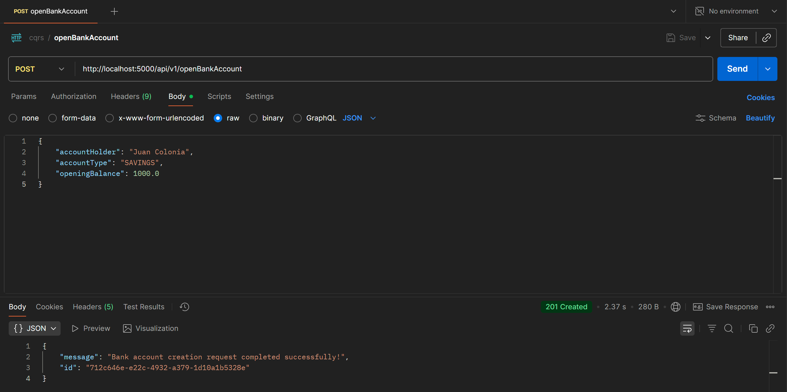
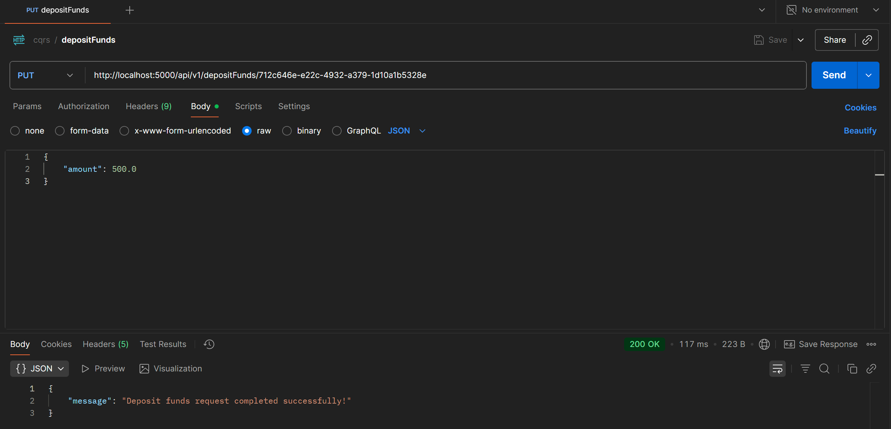
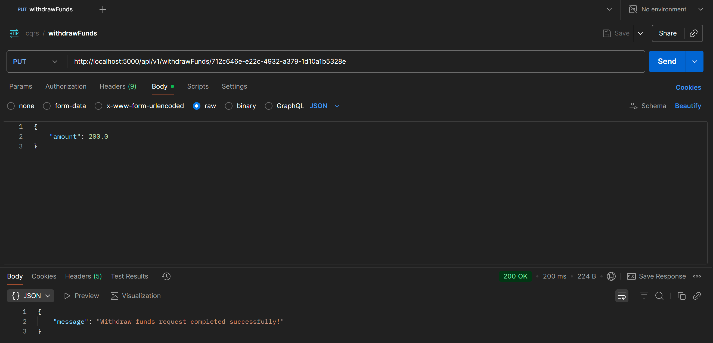
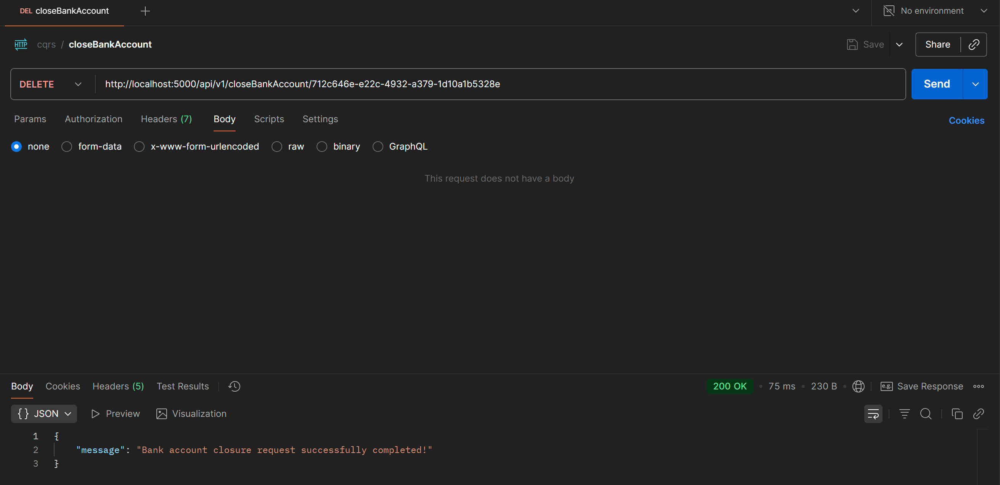
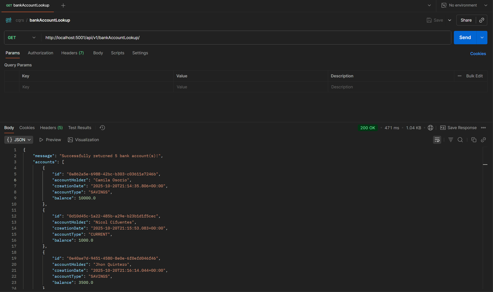
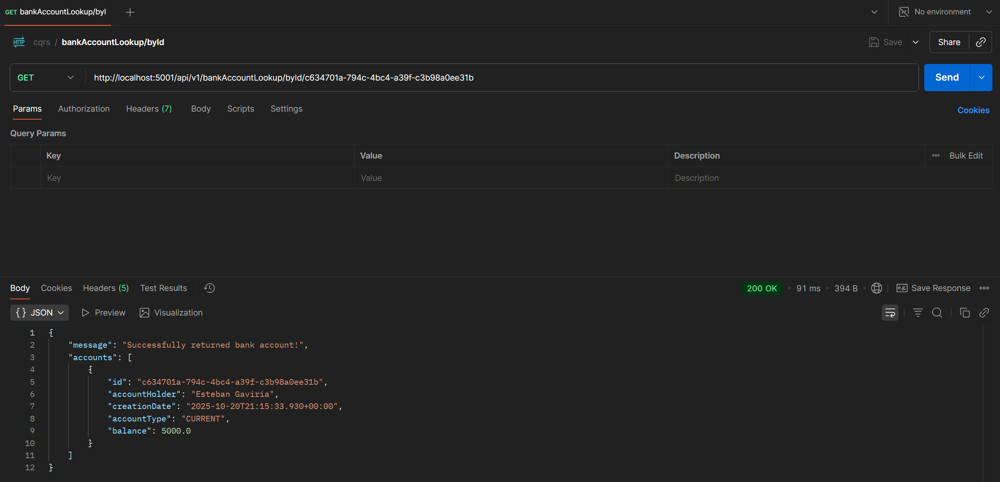
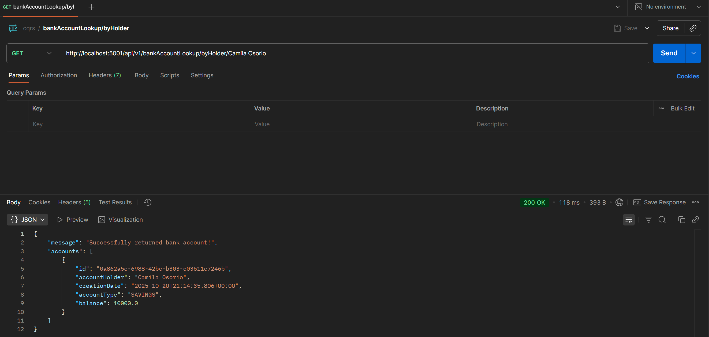
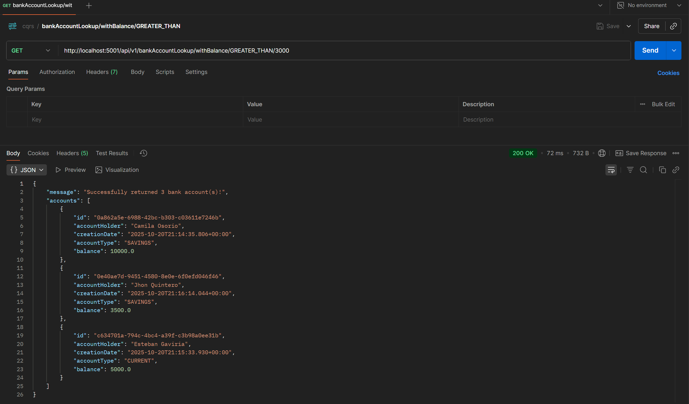
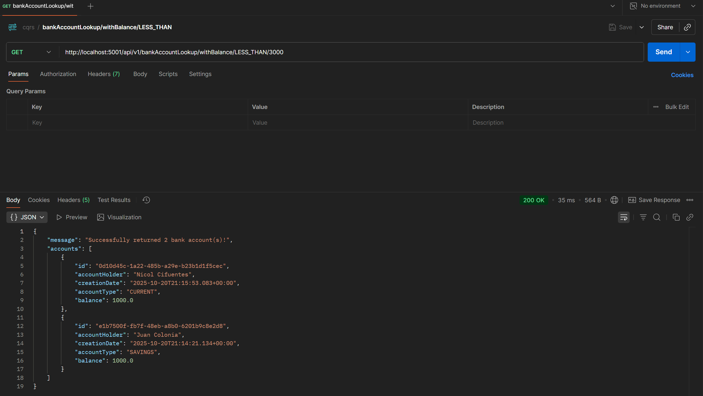
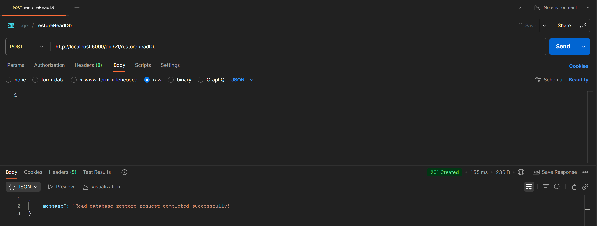

# Sistema Bancario CQRS + Event Sourcing con Kafka


## Descripción

Sistema bancario implementando los patrones **CQRS** (Command Query Responsibility Segregation) y **Event Sourcing** utilizando Apache Kafka como sistema de mensajería distribuida. El proyecto demuestra la separación de responsabilidades entre comandos (escritura) y consultas (lectura), garantizando el orden de consumo de eventos mediante un topic único de Kafka.

## Tabla de Contenidos

- [Arquitectura](#arquitectura)
- [Estructura del Proyecto](#estructura-del-proyecto)
- [Tecnologías Utilizadas](#tecnologías-utilizadas)
- [Interacción entre Componentes](#interacción-entre-componentes)
- [Configuración e Instalación](#configuración-e-instalación)
- [Ejecución](#ejecución)
- [Pruebas de Endpoints](#pruebas-de-endpoints)

## Arquitectura

El sistema está dividido en dos servicios principales siguiendo el patrón CQRS:

```
┌─────────────────────────────────────────────────────────────────┐
│                        CQRS Architecture                        │
├─────────────────────────────────────────────────────────────────┤
│                                                                 │
│  ┌──────────────┐          ┌──────────────┐                     │
│  │   Client     │          │   Client     │                     │
│  └──────┬───────┘          └──────┬───────┘                     │
│         │                         │                             │
│         │ Commands                │ Queries                     │
│         │                         │                             │
│  ┌──────▼──────────┐        ┌─────▼────────────┐                │
│  │  Command API    │        │    Query API     │                │
│  │  (Port 5000)    │        │   (Port 5001)    │                │
│  └──────┬──────────┘        └─────▲────────────┘                │
│         │                         │                             │
│         │ Store Events            │ Consume Events              │
│         │                         │                             │
│  ┌──────▼──────────┐        ┌─────┴────────────┐                │
│  │    MongoDB      │        │      MySQL       │                │
│  │  (Event Store)  │        │  (Read Model)    │                │
│  └──────┬──────────┘        └──────────────────┘                │
│         │                                                       │
│         │ Produce                                               │
│         │                                                       │
│  ┌──────▼───────────────────────────────────────────────────┐   │
│  │              Apache Kafka - Topic: BankAccountEvents     │   │
│  └──────────────────────────────────────────────────────────┘   │
│                                                                 │
└─────────────────────────────────────────────────────────────────┘
```

### Command Side (Escritura)

- **Responsabilidad**: Manejar comandos que modifican el estado
- **Base de Datos**: MongoDB (Event Store)
- **Puerto**: 5000
- **Funciones**:
  - Abrir cuentas bancarias
  - Depositar fondos
  - Retirar fondos
  - Cerrar cuentas

### Query Side (Lectura)

- **Responsabilidad**: Manejar consultas del estado actual
- **Base de Datos**: MySQL (Read Model)
- **Puerto**: 5001
- **Funciones**:
  - Consultar todas las cuentas
  - Buscar cuenta por ID
  - Buscar cuentas por titular
  - Buscar cuentas por balance
  - Restaurar base de datos de lectura

## Estructura del Proyecto

```
cqrs-event-sourcing-kafka/
│
├── cqrs-es/                          # Framework CQRS Core
│   └── cqrs.core/
│       └── src/main/java/com/techbank/cqrs/core/
│           ├── commands/              # Interfaces para comandos
│           ├── domain/                # Agregados y entidades base
│           ├── events/                # Eventos base
│           ├── handlers/              # Handlers de eventos
│           ├── infrastructure/        # Event Store, Dispatchers
│           ├── messages/              # Mensajes base
│           ├── producers/             # Productores de eventos
│           └── queries/               # Queries base
│
├── bank-account/                     # Aplicación bancaria
│   ├── account.common/               # DTOs y Eventos comunes
│   │   └── src/main/java/com/techbank/account/common/
│   │       ├── dto/
│   │       │   ├── AccountType.java
│   │       │   └── BaseResponse.java
│   │       └── events/
│   │           ├── AccountOpenedEvent.java
│   │           ├── FundsDepositedEvent.java
│   │           ├── FundsWithdrawnEvent.java
│   │           └── AccountClosedEvent.java
│   │
│   ├── account.cmd/                  # Command Side (Escritura)
│   │   ├── Dockerfile
│   │   └── src/main/java/com/techbank/account/cmd/
│   │       ├── CommandApplication.java
│   │       ├── api/
│   │       │   ├── commands/         # Comandos de negocio
│   │       │   ├── controllers/      # Endpoints REST
│   │       │   └── dto/              # DTOs de respuesta
│   │       ├── domain/
│   │       │   ├── AccountAggregate.java    # Lógica de negocio
│   │       │   └── EventStoreRepository.java
│   │       └── infrastructure/
│   │           ├── AccountCommandDispatcher.java
│   │           ├── AccountEventProducer.java
│   │           ├── AccountEventSourcingHandler.java
│   │           └── AccountEventStore.java
│   │
│   └── account.query/                # Query Side (Lectura)
│       ├── Dockerfile
│       └── src/main/java/com/techbank/account/query/
│           ├── QueryApplication.java
│           ├── api/
│           │   ├── controllers/      # Endpoints REST de consulta
│           │   ├── dto/
│           │   └── queries/
│           ├── domain/
│           │   ├── BankAccount.java  # Entidad de lectura
│           │   └── AccountRepository.java
│           └── infrastructure/
│               ├── AccountQueryDispatcher.java
│               ├── consumers/
│               │   ├── EventConsumer.java
│               │   └── AccountEventConsumer.java
│               └── handlers/
│                   ├── EventHandler.java
│                   └── AccountEventHandler.java
│
└── docker-compose.yml                # Orquestación de servicios
```

## Tecnologías Utilizadas

### Backend Framework

- **Java 16**: Lenguaje de programación
- **Spring Boot 2.4.5**: Framework para microservicios
- **Spring Data JPA**: Para acceso a MySQL
- **Spring Data MongoDB**: Para acceso a MongoDB
- **Spring Kafka**: Cliente de Kafka para Java

### Infraestructura

- **Apache Kafka 7.4.0**: Sistema de mensajería distribuida
- **Zookeeper 7.4.0**: Coordinación de Kafka
- **MongoDB 6.0**: Base de datos NoSQL para Event Store
- **MySQL 8.0**: Base de datos relacional para Read Model

### Herramientas

- **Maven**: Gestión de dependencias y compilación
- **Docker & Docker Compose**: Contenedorización y orquestación
- **Lombok**: Reducción de código boilerplate

## Interacción entre Componentes

### Flujo de Escritura (Commands)

1. **Cliente** envía un comando HTTP (POST/PUT/DELETE) al **Command API**
2. **CommandDispatcher** enruta el comando al handler correspondiente
3. **CommandHandler** ejecuta la lógica de negocio en el **Aggregate**
4. **Aggregate** genera eventos de dominio
5. **EventStore** persiste los eventos en **MongoDB**
6. **EventProducer** publica los eventos al topic **BankAccountEvents** en **Kafka**

### Flujo de Lectura (Queries)

1. **EventConsumer** consume eventos del topic **BankAccountEvents**
2. **EventHandler** procesa el evento y actualiza el **Read Model**
3. **Read Model** se persiste en **MySQL**
4. **Cliente** realiza consultas HTTP (GET) al **Query API**
5. **Query API** consulta directamente la base de datos **MySQL**

### Ventajas de esta Arquitectura

1. **Escalabilidad**: Command y Query pueden escalar independientemente
2. **Performance**: Las consultas no afectan el rendimiento de escrituras
3. **Auditoría**: Todos los eventos quedan registrados en el Event Store
4. **Recuperación**: Posibilidad de reconstruir el estado desde los eventos
5. **Desacoplamiento**: Los componentes se comunican mediante eventos

## Configuración e Instalación

### Prerequisitos

- **Docker Desktop**: Para ejecutar los contenedores
- **Java 16+**: Para desarrollo local (opcional)
- **Maven 3.8+**: Para compilación local (opcional)

### Visualizadores de Bases de Datos

El proyecto incluye herramientas web para visualizar las bases de datos:

#### phpMyAdmin (MySQL)

- **URL**: http://localhost:8080
- **Usuario**: root
- **Contraseña**: techbankRootPsw
- **Base de datos**: bankAccount
- Permite visualizar el Read Model (consultas)

#### Mongo Express (MongoDB)

- **URL**: http://localhost:8081
- **Usuario**: admin
- **Contraseña**: admin
- **Base de datos**: bankAccount
- Permite visualizar el Event Store (eventos)

## Ejecución

### 1. Clonar el Repositorio

```bash
git clone https://github.com/jdColonia/cqrs-event-sourcing-kafka
cd cqrs-event-sourcing-kafka
```

### 2. Construir y Levantar los Servicios

```bash
docker-compose up --build
```

### 3. Verificar los Servicios

```bash
docker-compose ps
```

Deberías ver todos los servicios en estado `Up`.

### 4. Ver Logs

```bash
# Ver logs de todos los servicios
docker-compose logs -f

# Ver logs de un servicio específico
docker-compose logs -f account-cmd
docker-compose logs -f account-query
```

### 5. Detener los Servicios

```bash
docker-compose down
```

Para eliminar también los volúmenes:

```bash
docker-compose down -v
```

## Pruebas de Endpoints

A continuación se detallan todas las pruebas de los endpoints con ejemplos de request y response.

### Parte 1: Endpoints del Command API (Puerto 5000)

#### 1.1 OpenAccountController - Abrir Cuenta Bancaria

**Endpoint**: `POST http://localhost:5000/api/v1/openBankAccount`

**Request Body**:

```json
{
  "accountHolder": "Juan Colonia",
  "accountType": "SAVINGS",
  "openingBalance": 1000.0
}
```

**Captura de Pantalla de Prueba**:



#### 1.2 DepositFundsController - Depositar Fondos

**Endpoint**: `PUT http://localhost:5000/api/v1/depositFunds/{id}`

**Request Body**:

```json
{
  "amount": 500.0
}
```

**Captura de Pantalla de Prueba**:



#### 1.3 WithdrawFundsController - Retirar Fondos

**Endpoint**: `PUT http://localhost:5000/api/v1/withdrawFunds/{id}`

**Request Body**:

```json
{
  "amount": 200.0
}
```

**Captura de Pantalla de Prueba**:



#### 1.4 CloseAccountController - Cerrar Cuenta

**Endpoint**: `DELETE http://localhost:5000/api/v1/closeBankAccount/{id}`

**Captura de Pantalla de Prueba**:



### Parte 2: Endpoints del Query API (Puerto 5001)

> [!IMPORTANT]
> Con el fin de ilustrar la funcionalidad, se registraron varias cuentas bancarias en esta etapa.

#### 2.1 AccountLookupController - Obtener Todas las Cuentas

**Endpoint**: `GET http://localhost:5001/api/v1/bankAccountLookup/`

**Captura de Pantalla de Prueba**:



#### 2.2 AccountLookupController - Buscar Cuenta por ID

**Endpoint**: `GET http://localhost:5001/api/v1/bankAccountLookup/byId/{id}`

**Captura de Pantalla de Prueba**:



#### 2.3 AccountLookupController - Buscar Cuenta por Titular

**Endpoint**: `GET http://localhost:5001/api/v1/bankAccountLookup/byHolder/{accountHolder}`

**Captura de Pantalla de Prueba**:



#### 2.4 AccountLookupController - Buscar Cuentas con Balance Específico

**Endpoint**: `GET http://localhost:5001/api/v1/bankAccountLookup/withBalance/{equalityType}/{balance}`

**Ejemplo 1 - Balance Mayor que 3000**:

**Endpoint**: `GET http://localhost:5001/api/v1/bankAccountLookup/withBalance/GREATER_THAN/3000`

**Captura de Pantalla de Prueba**:



**Ejemplo 2 - Balance Menor que 3000**:

**Endpoint**: `GET http://localhost:5001/api/v1/bankAccountLookup/withBalance/LESS_THAN/3000`

**Captura de Pantalla de Prueba**:



#### 2.5 RestoreReadDbController - Restaurar Base de Datos de Lectura

**Endpoint**: `POST http://localhost:5000/api/v1/restoreReadDb`

**Captura de Pantalla de Prueba**:


